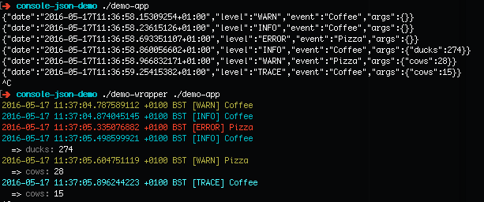

Console JSON log demo
=====================

- [app](app) generates some example JSON log output
- [wrapper](wrapper) parses it and adds formatting

To run the demo:

```bash
# Build the app and wrapper
go build -o demo-app ./app
go build -o demo-wrapper ./wrapper

# Run the app using the wrapper
./demo-wrapper ./demo-app
```


